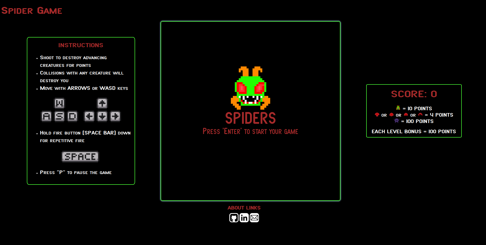
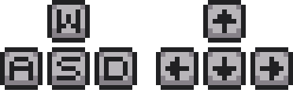

# Spiders-Game
## URL: https://jeffreyferrert.github.io/Spiders-Game/


# Description
Spider is a replica of the Atari game Centipede (1982). This is a fixed shooter arcade video game and the objective is to shoot all the spiders that comes from the top to the bottom. The board fill with random blocks and the speed of the game will increase as the game progress. 

# Controls
**Use keys to move across the board** <br>

<br>
**Use spacebar to shoot the spiders** <br>
<br>

# Wireframe

 

<ul>
    <li>On the top: Group of spiders (10 each time) generate randomly the position and direction of the group</li>
    <li>In the center: Obstacles are generated randomly and collision rules are applied to each of the interactions that happens on this area (i.e. blocks/spiders, blocks/bullets and spiders/bullets)</li>
    <li>On the bottom: The  </li>
</ul>

# Technical Details
Spider is code in Javascript and the game is drawn into a canvas element and uptdated using requestAnimationFrame. ...


# Code Snippets
### Collision was handle for each of the interaction that happens on the game board (blocks/spiders, blocks/bullets and spiders/bullets)
```javascript     
checkCollision() {
    this.player.bullets.forEach(bullet => {
        this.obstacles.obstacles.forEach(obstacle => {
            const [x1, y1] = [obstacle.x, obstacle.y];
            const [x2, y2] = [bullet.x, bullet.y];
            const dist = getDistance(x1, y1, x2, y2);
            if (dist <= 10) {
                this.obstacles.hit(obstacle);
                this.points++;
                this.player.destroy(bullet);
            }
        });

        this.spiders.spiders.forEach(spider => {
            const [x1, y1] = [spider.x, spider.y];
            const [x2, y2] = [bullet.x, bullet.y];
            const dist = getDistance(x1, y1, x2, y2);
            if (dist <= 10) {
                this.spiders.destroy(spider);
                this.player.destroy(bullet);
                this.obstacles.newBlock(x1, y1);
                this.points += 10;
                if (this.spiders.spiders.length === 0) {
                    this.points += 100;
                    alert("LEVEL PASS"); 
                }
            } 
        })
    })
    ...
}

```

### Spiders randomly generated their position in the x-axis and direction (left/right) in the constructor, then botha are pass to the initialize function
```javascript     
export default class Spiders {
    constructor(options) {
        this.x = helper_functions.getRandomInt(200, 500);
        this.y = 0;
        this.spiders = [];
        this.direction = Math.pow(-1, helper_functions.getRandom(2));

        this.initialize();
    }

    initialize() {
        for (let i = 0; i < 10; i++) {
            const newSpider = new Spider({
                x: this.x + 20 * i * this.direction,
                y: this.y,
                direction: this.direction
            })

            this.spiders.push(newSpider);
        }
    }
    ...
}
```

# Features in Development
<ul>
    <li>New enemy types</li>
    <li>Save player score and display historic high scores</li>
</ul>

<!-- # Implementation Timeline
<ul>
    <li>Thursday: Setting up my enviroment and start with the creation of the wireframe i'll be working on / if time i'll be creating the spiders class and their movement throughthe page
    <li>Friday: starting/finishing the spiders interaction</li>
    <li>Saturday and Sunday: create the blaster and randomly generated blocks within the wireframe</li> 
    <li>Monday: put together all the elements and start working on the cases where them colide</li>
    <li>Tuesday: finalizing the colission cases and getting ready to final testing</li>
    <li>Wednesday: working on styling and final details of the project</li>
    <li>Thursday: Getting feedback from my pairs and work on little improvements until the presentation beggin</li>
</ul> -->
